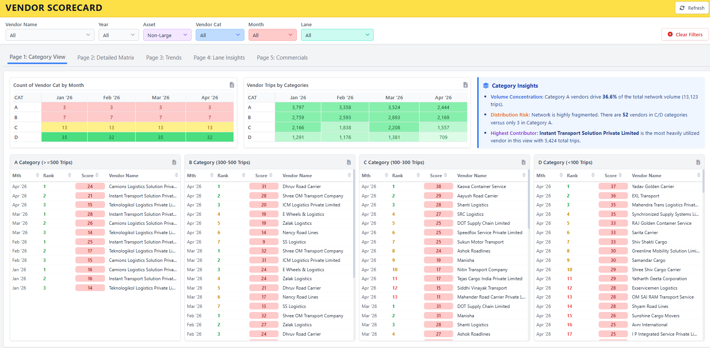
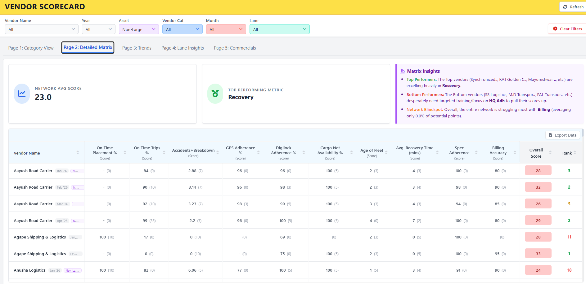
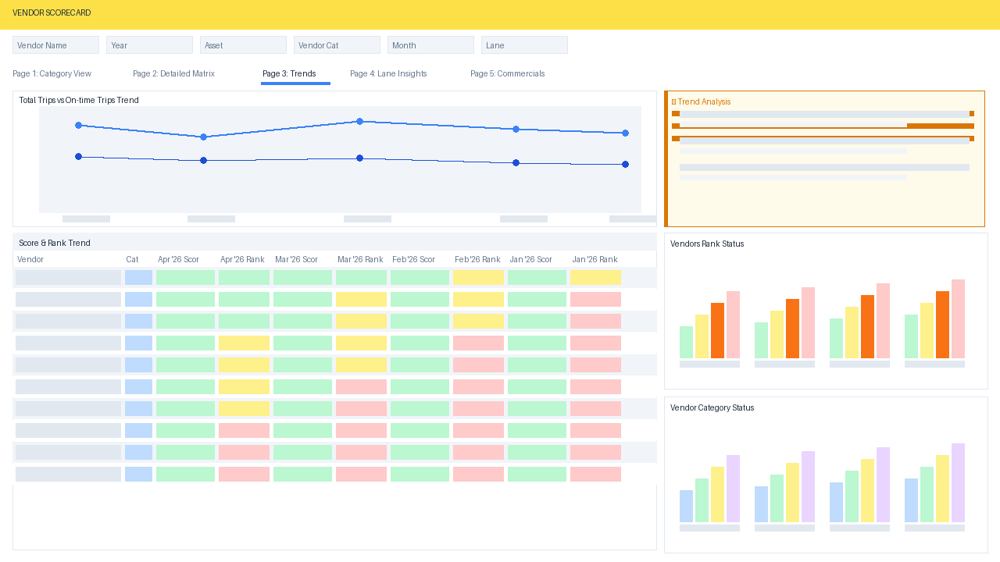
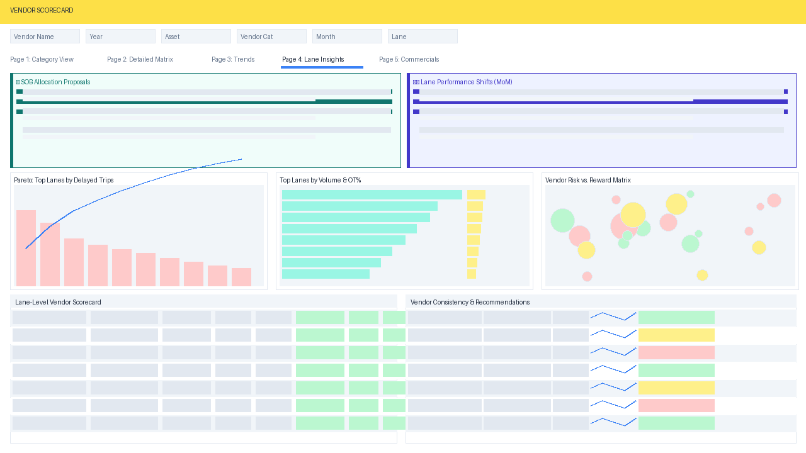
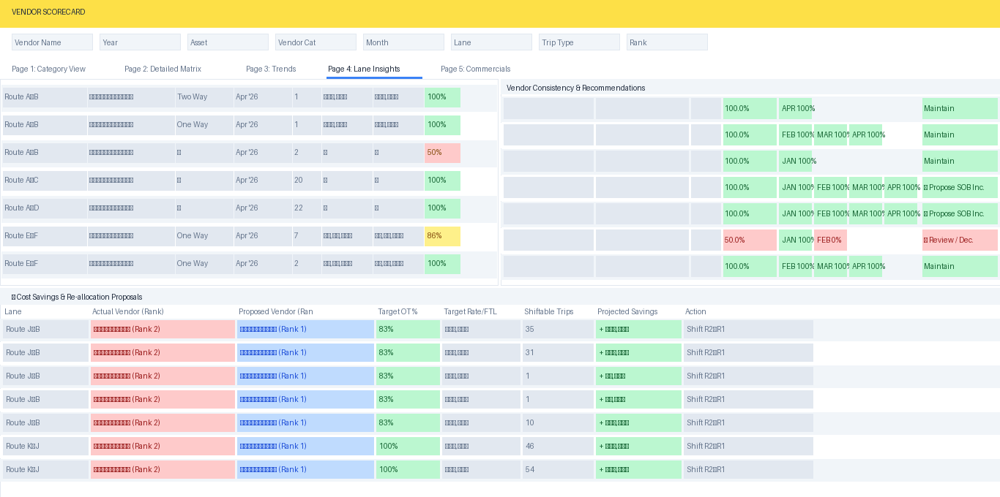
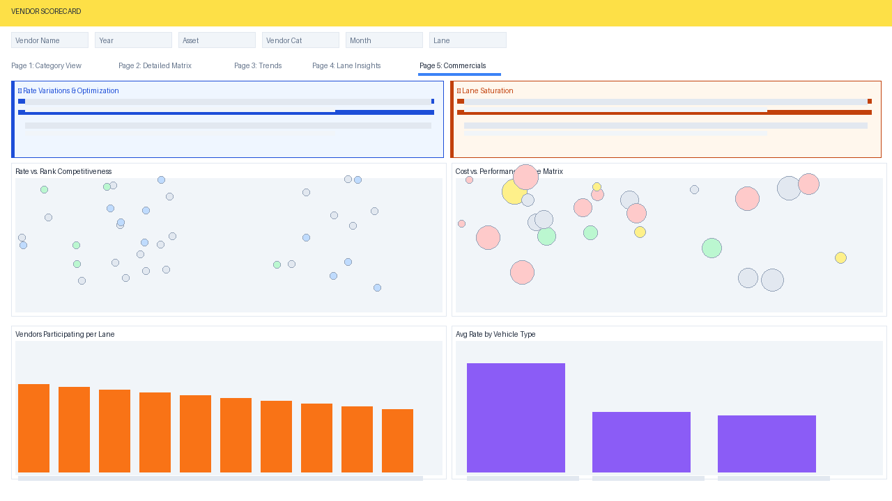

# 🏆 Vendor Performance Scorecard — Analytics to Action

> *From raw operational data to boardroom-ready insights — this project covers the full cycle: building the intelligence layer, surfacing actionable findings, driving stakeholder conversations, and tracking real business outcomes.*

---

## 📌 What This Project Is Really About

Most analytics work stops at the dashboard. This one doesn't.

This Vendor Performance Scorecard was conceived, built, and operationalised as a **end-to-end analytics initiative** — not just a reporting tool. The objective was to move the organisation from gut-feel vendor decisions to a structured, data-backed vendor governance framework.

The project spans three distinct phases:

```
Phase 1 — Build        →    Phase 2 — Insight        →    Phase 3 — Action
─────────────────────       ──────────────────────────     ─────────────────────
Design scoring logic        Surface what matters           Present to stakeholders
Automate data pipeline      Identify risks & savings       Drive decisions
Build live dashboard        Generate recommendations        Track outcomes
```

---

## 🎯 Business Context

Managing a logistics network with a large number of vendors across multiple lanes and asset types creates a core challenge: **how do you know which vendors deserve more business, which need intervention, and which are quietly costing you money?**

Before this initiative, vendor reviews were periodic, manually compiled, and reactive. This project replaced that with a **always-on, self-refreshing scorecard** that answers those questions automatically — and more importantly, creates the foundation for structured vendor conversations backed by data rather than opinion.

---

## 🖥️ Dashboard — 5-Page Analytical Cockpit

### Page 1 — Category View
Vendors are automatically tiered into categories (A / B / C / D) based on monthly trip volume, giving the team an instant view of network concentration, fragmentation risk, and top contributors across months.



---

### Page 2 — Detailed Scorecard Matrix
Every vendor is scored across **10 operational KPIs** — each weighted to reflect business priority. The matrix makes performance gaps visible at a glance and auto-generates insights on top performers, bottom performers, and network-wide blind spots.

| KPI | What it measures |
|---|---|
| On-Time Placement % | Truck availability against committed schedule |
| On-Time Trips % | Delivery compliance at destination |
| Accidents + Breakdown Rate | Safety and fleet reliability index |
| GPS Adherence % | Route discipline and tracking compliance |
| Digital Lock Adherence % | Security protocol adherence |
| Cargo Net Availability % | Load safety compliance |
| Age of Fleet | Fleet freshness proxy |
| Avg. Recovery Time (mins) | Incident response speed |
| Spec Adherence | Vehicle specification compliance |
| Billing Accuracy | Invoice and documentation accuracy |



---

### Page 3 — Trends
Month-over-month performance tracking for every vendor — score movement, rank changes, category shifts, and network-level volume trends. The most-improved and most-declined vendors are automatically surfaced.



---

### Page 4 — Lane Insights
The operations intelligence layer — where data meets decision-making.

- **SOB (Share of Business) Proposals** — data-backed recommendations on which vendors should receive more or less volume on which lanes
- **Lane Performance Shifts** — MoM degradation flags, chronic underperformance alerts, volatility detection
- **Cost Savings Engine** — automatically identifies lanes where volume reallocation to a better-ranked, lower-rate vendor yields measurable savings
- **Vendor Consistency Tracker** — MoM trend sparklines with explicit Maintain / Propose SOB Increase / Review & Decrease recommendations




---

### Page 5 — Commercials
Rate intelligence layer — benchmarks every vendor's rate against the L1 (lowest) rate on that lane, identifies high-variance lanes for negotiation, and maps cost vs. performance to find vendors who are expensive *and* underperforming.



---

## 📊 From Insight to Action — The Stakeholder Journey

> *This is where the project moves beyond analytics.*

The dashboard outputs were not left as self-serve reports. They were structured into a **monthly vendor review cadence** with relevant stakeholders — operations leads, procurement, and regional teams.

### How insights were translated into conversations:

**1. Pre-meeting preparation**
Before each review, the scorecard was filtered to the relevant lane/region and key findings were extracted — top 3 risks, top 3 opportunities, and any cost savings identified by the reallocation engine.

**2. Structured review format**
Each vendor review followed a consistent structure driven by the dashboard:
- Current score and rank vs. last month
- Which KPI is pulling the score down and why
- Lane-level OT% trend and consistency rating
- SOB recommendation (increase / maintain / reduce) with data rationale

**3. Action ownership**
Every finding that required action was assigned an owner and a timeline during the review. The dashboard's recommendation column (Maintain / Propose SOB Inc. / Review & Decrease) served as the starting point for each conversation — giving stakeholders a data-backed proposal to react to rather than an open-ended discussion.

**4. Outcome tracking**
Where SOB reallocation was proposed and accepted, the cost savings engine's projections were tracked against actual spend in subsequent months to validate the model and build confidence in the framework.

---

## 💰 Business Value Delivered

> *Numbers are indicative and direction-correct; specific figures are kept confidential.*

| Outcome | How the dashboard enabled it |
|---|---|
| Identified monthly cost saving opportunities | Cost reallocation engine compared rates across vendors on same lanes and flagged shiftable volume |
| Structured vendor governance cadence established | Monthly review rhythm created using scorecard outputs as the agenda |
| Underperforming vendors flagged for improvement plans | Bottom-performer identification on Page 2 and MoM decline detection on Page 3 |
| Top vendors rewarded with SOB increases | SOB Allocation Proposals on Page 4 used as basis for volume reallocation decisions |
| Network blind spots addressed | Billing accuracy and spec adherence gaps surfaced across the fleet, feeding into process improvement conversations |
| Reduced subjectivity in vendor conversations | Every decision point backed by a data trail rather than relationship bias |

---

## ⚙️ Technical Stack

| Layer | Technology |
|---|---|
| Backend / Data | Google Apps Script — server-side data fetch from Google Sheets |
| Data Source | Google Sheets (Scorecard, Lane Performance, Commercial Master) |
| Frontend | Vanilla HTML5 + JavaScript (ES6+) |
| Styling | Tailwind CSS (CDN) |
| Charts | Chart.js + chartjs-plugin-datalabels |
| Icons | FontAwesome 6 |
| Hosting | Google Apps Script Web App |

---

## 🔑 Key Technical Features

- **Live Data Refresh** — single-click pulls latest data without page reload
- **Multi-Dimensional Filters** — 6–8 cascaded filters with multi-select, persisting across tab switches
- **Cross-Chart Filtering** — clicking any chart element filters the entire dashboard instantly
- **Vendor Name Standardisation Engine** — normalises inconsistent spellings across all three data sources
- **Cost Savings Engine** — auto-identifies reallocation opportunities and quantifies projected monthly savings
- **MoM Trend Sparklines** — per-vendor, per-lane trend rendered inline in the consistency table
- **Export Everything** — every table to Excel (with formatting), every chart to CSV
- **Sortable Tables** — every column, every table, click-sortable

---

## 🛠️ Skills This Project Demonstrates

| Skill Area | Specifics |
|---|---|
| **Analytics & BI** | KPI design, weighted scoring, vendor tiering, Pareto analysis, MoM trend detection |
| **Business Acumen** | Translating data findings into stakeholder-ready recommendations and SOB proposals |
| **Stakeholder Management** | Driving monthly review cadence, owning the data narrative in cross-functional reviews |
| **Cost Optimisation** | Building and operationalising a reallocation savings engine with trackable outcomes |
| **Cost & Rate Intelligence** | Lane-level cost variance analysis by vendor, trip type (One Way / Two Way), and vehicle type; L1 benchmark identification; premium-over-benchmark quantification per vendor per lane |
| **Frontend Engineering** | Single-page app architecture, Chart.js, Tailwind CSS, responsive layout |
| **Automation** | Google Apps Script backend, Sheets integration, Web App deployment |
| **Communication** | Converting complex multi-dimensional data into clear, actionable business language |

---

## 🔒 Data Privacy

All vendor names, route identifiers, rates, and operational metrics shown in screenshots are masked or anonymised. No proprietary or confidential commercial data is present in this repository.

---

## 👤 Author

Built, operationalised, and actively used to drive vendor governance decisions as part of logistics operations analytics work.

*Open to questions, collaborations, or conversations about analytics-driven operations.*

---

*Built with Google Apps Script · Chart.js · Tailwind CSS · Google Sheets*
